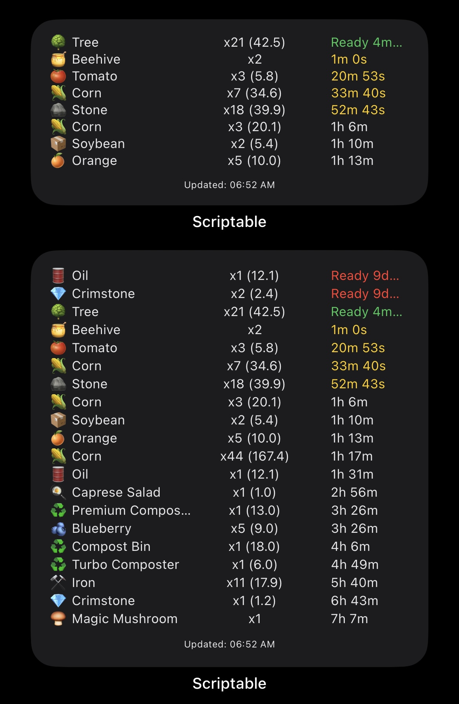
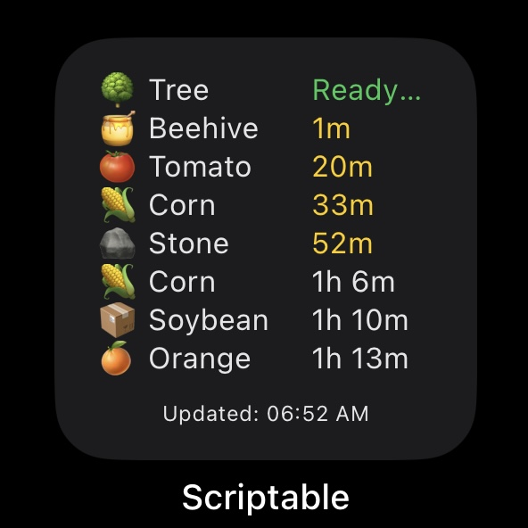
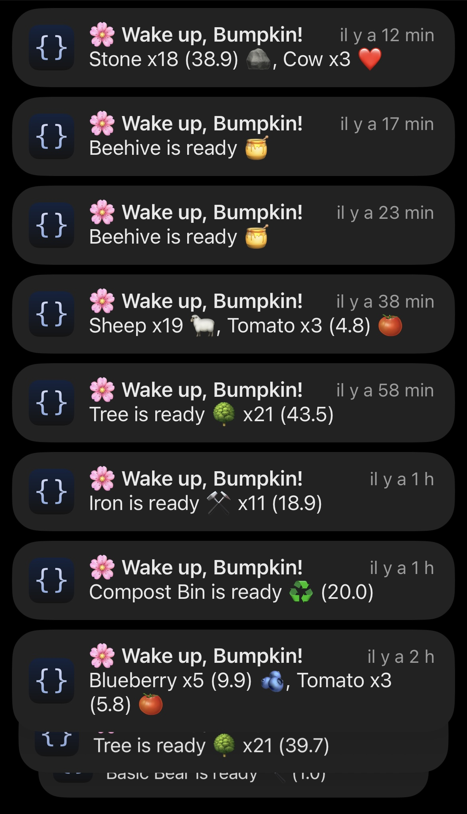

# 🌻 Sunflower Land Widget for iOS with Notifications  
*English / Français*

---

## 📸 Preview / Aperçu

Here are some screenshots of the widget on iOS:







---

## 🇬🇧 English Version

### What is it?

A small iPhone widget that shows your **Sunflower Land** game elements directly on your home screen — **with notifications** to keep you updated about your farm!

---

## 📸 Preview / Aperçu

Here are some screenshots of the widget on iOS:


---

### 📱 Installation Steps

1. **Install Scriptable**  
   - Open the App Store  
   - Search for **Scriptable** (free)  
   - Download and open it at least once  

2. **Add the script**  
   - Open Scriptable  
   - Tap the **+** button (top right)  
   - Copy the entire content of `sunflower-widget-final.js`  
   - Paste it into the new script  
   - Name the script (e.g., "Sunflower Land")  

3. **Set your Farm ID**  
   - In the script, find line 8:  
     ```js
     const FARM_ID = "XXXXX";
     ```  
   - Replace `"XXXXX"` with your farm ID  

   **How to find your Farm ID:**  
   - Go to https://sunflower-land.com/play  
   - Log into your farm  
   - Click the gear icon (⚙️) → Game Options  
   - Copy the Farm ID shown at the top  
   - Paste it into the script  

4. **Add the widget to your home screen**  
   - Long press on your iPhone home screen  
   - Tap the **+** button (top left)  
   - Search for **Scriptable**  
   - Choose widget size (Small / Medium / Large)  
   - Tap **Add Widget**  
   - Configure widget → Script → Select your script  
   - Tap **Done**

---

### 🎮 Usage

- Widget shows **all your farm elements**: trees, crops, animals, and more  
- Color codes:  
  🔴 Ready for more than 1 day  
  🟢 Ready for less than 1 day  
  🟡 Ready for less than 1 hour  
  ⚪ Not ready yet  
- Tap the widget to force an immediate update  

---

### 🔔 Notifications

- Enable notifications for Scriptable:  
  Go to **Settings > Notifications > Scriptable** → Allow Notifications  
- The widget sends alerts when your items are ready  
- Open Scriptable regularly to keep notifications working properly  

---

### ⚠️ Troubleshooting & Tips

| Problem                        | Solution                                                  |
|-------------------------------|-----------------------------------------------------------|
| Scriptable not showing in widgets | Restart iPhone, open Scriptable once, try adding widget again |
| "No items tracked"             | Check your Farm ID, internet connection, and active farm items |
| Widget not updating            | Tap widget to refresh, open Scriptable app regularly      |
| No notifications              | Allow notifications in settings, check phone sound mode   |
| Script errors or crashes      | Update iOS, restart iPhone, open Scriptable and check console |

---

### 🌟 Tips for Best Experience

- Open Scriptable from time to time (keeps the app active)  
- Use your phone regularly (prevents deep sleep)  
- Keep Scriptable running in background  
- Tap the widget for instant updates  

---

## 🇫🇷 Version Française

### Qu’est-ce que c’est ?

Un petit widget iPhone qui affiche tous les éléments de votre ferme **Sunflower Land** directement sur votre écran d’accueil — **avec notifications** pour ne rien manquer !

---

### 📱 Étapes d’installation

1. **Installer Scriptable**  
   - Ouvrez l’App Store  
   - Cherchez **Scriptable** (gratuit)  
   - Téléchargez et ouvrez au moins une fois  

2. **Ajouter le script**  
   - Ouvrez Scriptable  
   - Appuyez sur le bouton **+** (en haut à droite)  
   - Copiez tout le contenu du fichier `sunflower-widget-final.js`  
   - Collez-le dans le nouveau script  
   - Donnez un nom à votre script (ex : "Sunflower Land")  

3. **Configurer votre Farm ID**  
   - Dans le script, trouvez la ligne 8 :  
     ```js
     const FARM_ID = "XXXXX";
     ```  
   - Remplacez `"XXXXX"` par votre Farm ID  

   **Comment trouver votre Farm ID :**  
   - Allez sur https://sunflower-land.com/play  
   - Connectez-vous à votre ferme  
   - Cliquez sur la roue dentée (⚙️) → Options du jeu  
   - Copiez le Farm ID affiché en haut  
   - Collez-le dans le script  

4. **Ajouter le widget sur l’écran d’accueil**  
   - Maintenez appuyé sur votre écran d’accueil iOS  
   - Appuyez sur le bouton **+** (en haut à gauche)  
   - Cherchez **Scriptable**  
   - Choisissez la taille du widget (Petit / Moyen / Grand)  
   - Appuyez sur **Ajouter le widget**  
   - Configurez le widget → Script → Sélectionnez votre script  
   - Appuyez sur **Terminé**

---

### 🎮 Utilisation

- Le widget affiche **tous vos éléments** de la ferme : arbres, cultures, animaux, etc.  
- Codes couleurs :  
  🔴 Prêt depuis plus d’1 jour  
  🟢 Prêt depuis moins d’1 jour  
  🟡 Prêt depuis moins d’1 heure  
  ⚪ Pas encore prêt  
- Tapez sur le widget pour forcer une mise à jour immédiate  

---

### 🔔 Notifications

- Activez les notifications pour Scriptable :  
  Allez dans **Réglages > Notifications > Scriptable** → Autoriser les notifications  
- Le widget vous envoie une alerte quand vos éléments sont prêts  
- Ouvrez Scriptable régulièrement pour garder les notifications actives  

---

### ⚠️ Problèmes & Solutions

| Problème                      | Solution                                                  |
|-------------------------------|-----------------------------------------------------------|
| Scriptable absent dans widgets | Redémarrez l’iPhone, ouvrez Scriptable une fois, essayez de nouveau |
| "Aucun élément suivi"          | Vérifiez votre Farm ID, connexion internet, éléments actifs |
| Widget ne se met pas à jour   | Appuyez sur le widget, ouvrez régulièrement Scriptable   |
| Pas de notifications          | Autorisez les notifications, vérifiez le mode son du téléphone |
| Erreurs dans le script        | Mettez iOS à jour, redémarrez l’iPhone, ouvrez Scriptable, regardez la console |

---

### 🌟 Astuces pour une meilleure expérience

- Ouvrez Scriptable de temps en temps (pour maintenir l’app active)  
- Utilisez votre téléphone régulièrement (évite la mise en veille profonde)  
- Gardez Scriptable en arrière-plan  
- Tapez sur le widget pour une mise à jour immédiate  

---

## 🎉 Enjoy your Sunflower Land widget with notifications! / Profitez bien de votre widget Sunflower Land avec notifications !
